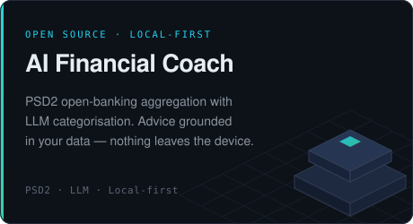
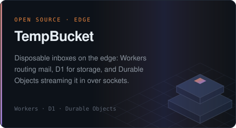

  
  
  

> I like the whole ladder — the architecture diagram, the service that implements it, and the interface people actually touch. Six years of building all three.

**Right now** — building LLM agents and developer tooling that remove real work, not demo work, and taking my own products from empty repo to real users.

**What I bring** — I own a feature from architecture to production: design systems that stop a team re-deciding the same things, infrastructure-as-code so environments are reproducible, and the analytics to know whether any of it actually worked.

**Before** — payments architecture at **Mercado Libre** (2022–24), 3D/AR on the web at **Fresco Design** (2020–22), and e-commerce platforms at **Krimax** (2019–20).

## Built from zero

<table>
  <tr>
    <td width="50%"></td>
    <td width="50%"></td>
  </tr>
  <tr>
    <td width="50%"></td>
    <td width="50%" valign="top">
       
      <b>ALSO IN THE LAB</b>  
      <a href="https://www.beacon-status.com"><b>Beacon</b></a> — uptime monitoring with instant alerts and shareable real-time status pages.  
      <a href="https://github.com/RubenChirino/trivia-app"><b>AI Trivia</b></a> — Android, LLM-generated question sets.  
      <a href="https://github.com/RubenChirino/harvest-bot"><b>HarvestBot</b></a> — Arduino irrigation driven by a Telegram bot.
    </td>
  </tr>
</table>

## Work projects

<table>
  <tr>
    <td width="20%" valign="top">
      <b>2022 — 2024</b> 
      MERCADO LIBRE
    </td>
    <td valign="top">
      <b><a href="https://www.mercadopago.com.ar/developers/es/live-demo/checkout-pro">MercadoPago Checkout</a></b> 
      The checkout behind Mercado Libre's marketplaces across Latin America — hosted, embedded and API flows, covering the local payment methods of every country the platform operates in. 
      PAYMENTS · A/B TESTING · SCALE
    </td>
  </tr>
  <tr>
    <td width="20%" valign="top">
      <b>2020 — 2022</b> 
      FRESCO DESIGN
    </td>
    <td valign="top">
      <b><a href="https://s3.us-east-1.amazonaws.com/fresco-augmented-reality.com/libs/demo/index.html">Fresco 3D Viewer</a></b> 
      A Three.js library for 3D viewing, AR and real-time texture manipulation, embeddable in Shopify, Wix, Squarespace and WordPress. <a href="https://equifit.com/en_us/custom-lab">EquiFit CustomLab</a> is the product configurator built on top of it. 
      THREE.JS · WEBXR · LIBRARY DESIGN
    </td>
  </tr>
  <tr>
    <td width="20%" valign="top">
      <b>2019 — 2020</b> 
      KRIMAX
    </td>
    <td valign="top">
      <b>E-commerce platforms</b> 
      Storefronts for client brands: social sign-up, multiple payment gateways and deeply customisable layouts, built on Laravel and .NET. 
      LARAVEL · .NET · BLAZOR · SQL SERVER
    </td>
  </tr>
</table>

## Stack

